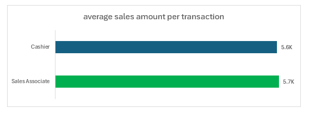
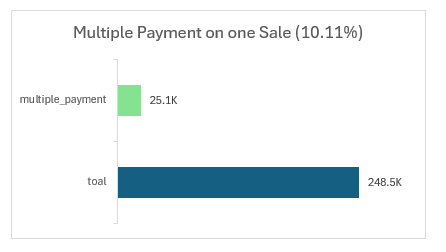

# hata_project_sql

# Hata Business Analysis Project

This project analyzes business performance, product trends, customer insights, store and employee performance, and operational efficiency using sales data from 2023-2024. Below are the key questions addressed, with visuals and brief insights for each.

---

## I. Overall Business Performance & Financial Health

### 1. Revenue & Profit

#### 1.1.1 What is our total net revenue for the period of 2023-2024?
  
Insight: Overall revenue reached BDT 634.2 million for the period of 2023-2024, indicating strong financial performance.

#### 1.1.2 What is our total cost of goods sold (COGS) and our total gross profit for the same period?
  
For 2023-2024, the Cost of Goods Sold (COGS) stands at BDT 430.8 million, directly contributing to a net profit of BDT 203.4 million. These figures highlight the operational costs involved and the resulting profitability of the business.

#### 1.1.3 What is our overall gross profit margin (as a percentage)?

  
The business achieved a 47.18% Profit Margin, indicating that nearly half of every sales dollar translates into profit. This high percentage signifies strong cost management and pricing strategies, contributing significantly to overall financial health.

### 1.2 Growth & Trends

#### 1.2.1 How has our net revenue trended month-over-month and year-over-year throughout 2023 and 2024?
  
The company achieved a significant 20.1% overall revenue growth from 2023 to 2024, with annual revenues increasing from BDT 611.69 million to BDT 734.71 million.

Month-over-month (MOM) growth shows consistent positive trends, though a notable -29.5% dip occurred in January 2024, likely a seasonal effect after a strong December 2023.
#### 1.2.2 What is the average sales transaction value over the entire period?
   
The average sales value per transaction stands at BDT 5646. This metric provides insight into the typical size of customer purchases, which can inform pricing strategies and sales efforts.

---

## II. Product Performance

### 2.1 Best Sellers

#### 2.1.1 Which are our top 10 products by quantity sold?
  
"Hush Puppies ANDERSON Slip-On" is the top-selling product by a significant margin, with 20.0K units sold.

#### 2.1.2 Which are our top 10 products by net revenue generated?
  
"Hush Puppies ANDERSON Slip-On" is also the highest revenue-generating product, bringing in BDT 96.4 million.

The top revenue-generating products largely mirror the top-selling products by quantity.

#### 2.1.3 Top Product Categories by Net Revenue
  
Men's Footwear is the dominant category, generating BDT 859.5 million in net revenue, significantly outperforming other categories.

#### 2.1.4 Bottom Product Categories by Net Revenue
  
Kids' Footwear accounts for a comparatively smaller BDT 37.1 million, highlighting varying market strengths across segments.
#### 2.1.5 Top Product Categories by Units Sold
  
Men's Footwear leads significantly in unit sales with 279.7K units, reinforcing its strong market presence.

#### 2.1.6 Bottom Product Categories by Units Sold
  
Kids' Footwear shows a smaller volume at 26.6K units, which aligns with revenue distribution.

#### 2.1.7 Can you identify the top 5 brands by revenue?
  
Hata is the top-performing brand by a significant margin, generating BDT 347.8 million in net revenue.

The remaining top brands—Beinbrenner, Powers, South Star, and Hush Puppies—each contribute between BDT 96.4 million and BDT 140.0 million, highlighting Hata's dominant market share.
#### 2.1.8 Can you identify the top 5 brands by gross profit?
  
Hata leads significantly in gross profit, generating BDT 105.5 million, underscoring its profitability leadership.

Beinbrenner, Powers, South Star, and Hush Puppies follow, with gross profits ranging from BDT 25.3 million to BDT 56.9 million, indicating varying levels of profitability across the top brands.
### 2.2 Profitability by Product

#### 2.2.1 What is the average gross profit margin per product category?
  
Women's Footwear exhibits the highest gross margin at 50.1%, indicating strong profitability per sale in this category.

Men's Footwear follows with a 46% gross margin, while Kids' Footwear has the lowest at 39.5%, suggesting varying cost structures or pricing strategies across categories.

#### 2.2.2 Are there any specific products that have significantly higher gross profit margins than the average?
  
The "Beinbrenner WAVE Loafer" shows the greatest positive deviation from the average margin, at 30.9% above the average of 47.2%.

Several products, including "Kids Formal Shoes" and "Hata Leather Sandals," demonstrate significantly higher margins than the overall average, indicating their strong profitability contribution.

#### 2.2.3 Are there any specific products that have significantly lower gross profit margins than the average?
  
"South Star NANCY Slip-On" shows the largest negative deviation from the average margin, at -25% below the average of 47.2%.

Several products, including "South Star VARUN Sneaker" and "Bubblegummers Kids Sneaker," exhibit significantly lower margins than the overall average, indicating areas for potential margin improvement or strategic review.
#### 2.2.4 Are there any specific brands that have significantly higher gross profit margins than the average?
  
The "Kids" brand demonstrates the highest positive difference from the average margin at 29.8% above the overall average of 47.2%.

The "JUDY" brand also shows a strong positive deviation at 25.8% above average, indicating these brands are significant contributors to overall profitability.

#### 2.2.5 Are there any specific brands that have significantly lower gross profit margins than the average?
  
Bubblegummers shows the largest negative difference from the average margin at -22.9% below the overall average of 47.2%.

The "Woven" brand also has a significant negative deviation at -20.8% below average, indicating these brands are pulling down the overall margin and may require strategic attention.

### 2.3 Size & Material Analysis

#### 2.3.1 For our top-selling products, what are the most popular sizes? Does this vary by gender category?
  
For both Male and Female customers, "Hush Puppies ANDERSON Slip-On" and "Hata Executive Leather" are top sellers, with specific size IDs showing strong performance.

Male customers purchased 19,718 pairs of these top products, while Female customers purchased 11,935 pairs, indicating a higher overall volume from the male segment for these specific items.

#### 2.3.2 Which materials (e.g., Leather, Synthetic, Canvas) are most popular?
  
Rubber is the most sold material, accounting for 149.7K units, significantly leading other material types.
Mesh and Synthetic/Fabric also show strong sales, while Leather has the lowest unit sales at 38.0K, indicating consumer preference for non-leather materials.

#### 2.3.3 Which materials contribute how much to overall revenue and profit?
  
Rubber is the leading material, contributing 29.3% to overall revenue and an even higher 32.1% to overall profit, making it the most profitable material.
While Mesh, Synthetic, and Fabric contribute significantly to both revenue and profit, Leather shows the lowest contribution at 9.8% to revenue and 8.8% to profit, suggesting lower profitability or sales volume for leather products.

---

## III. Customer Insights

### 3.1 Demographics & Spending

#### 3.1.1 What is the distribution of our customer base by gender and city?
  
Dhaka has the highest number of customers (14,981 male and 9137 female), significantly more than any other city or gender segment.
#### 3.1.2 How does average spending differ between male and female customers?
  
The average spending by Male customers is BDT 5650, which is negligibly higher than that of Female customers at BDT 5638.
This indicates a very similar average transaction value across both genders, suggesting comparable purchasing behaviors in terms of spending per transaction.
#### 3.1.3 Which cities are generating the most customer traffic and revenue?
  
Dhaka is the primary revenue driver, generating a massive BDT 1017.1 million from 24.1K customers, dwarfing other cities.

Chattogram follows distantly with BDT 136.9 million from 3.3K customers, while other cities contribute significantly less, typically around BDT 8-10 million from fewer than 300 customers each.
### 3.2 Purchasing Behavior

#### 3.2.1 What is the average number of distinct items a customer buys in a single sale?
  
The average number of distinct items per transaction is 1.02. This low figure indicates that most transactions typically involve only a single unique product.

---

## IV. Store & Employee Performance

### 4.1 Store Performance

#### 4.1.1 Which are our top 3 performing stores in terms of net revenue?
  
Store '10th' is the highest revenue generator with BDT 115.8 million, slightly outperforming '1st' and '4th' stores.

The top three stores show very comparable revenue contributions, each generating over BDT 113 million, indicating strong performance across these key locations.

#### 4.1.2 Which are our bottom 3 performing stores in terms of net revenue?
  
Remarkably, there is minimal revenue disparity across both the top and bottom-performing stores. This suggests a highly consistent operational performance or similar market potential across all locations, rather than a few standout or underperforming outlets.

#### 4.1.3 How does the average transaction value compare across our different stores?
  
The average transaction value is remarkably consistent across all stores, hovering around BDT 5.6K - 5.7K.

This uniformity suggests that customer purchasing behavior in terms of transaction size is very similar across all store locations, rather than varying significantly by individual store performance.

### 4.2 Employee Contribution

#### 4.2.1 Who are our top 5 sales associates by total sales amount?
  
Sales associate '92th' leads with BDT 16.8 million in total sales, making them the top performer.

The top 5 sales associates show highly consistent performance, with total sales amounts ranging closely from BDT 15.9 million to BDT 16.8 million, indicating a strong and balanced contribution from the leading sales team members.

#### 4.2.2 How does the average sales amount per transaction differ between 'Cashier' and 'Sales Associate'?
  
Sales Associates have a slightly higher average sales amount per transaction at BDT 5.7K compared to Cashiers at BDT 5.6K.
This small difference suggests that Sales Associates might be more effective in driving slightly larger individual sales, aligning with their role in customer engagement.

---

## V. Operational Efficiency & Returns

### 5.1 Returns Analysis

#### 5.1.1 What is our overall return rate (total return amount as a percentage of total sales amount)?
  
The business experienced a 3.7% return rate, with BDT 50.3 million in returned amount against a total revenue of BDT 1361.8 million.
This low percentage indicates efficient operations or product quality, as only a small fraction of successful sales revenue is ultimately returned.

#### 5.1.2 What are the top 5 most common reasons for returns?
  
"Wrong Size" is the leading reason for returns by amount, totaling BDT 2515, highlighting a significant issue in sizing accuracy or customer selection.
Other top reasons, including "Unsatisfied," "Changed Mind," "Gift Return," and "Defective Product," follow closely, each contributing around BDT 2381-2441 to the total returned amount.
#### 5.1.3 Are there specific products that have a disproportionately high return rate?
  
Women's Footwear has the highest return percentage at 3.63%, closely followed by Men's Footwear at 3.61% and Kids' Footwear at 3.55%.
The return rates across all footwear categories are remarkably similar and relatively low, indicating consistent product satisfaction or return behavior across these segments.

#### 5.1.4 Are there specific categories that have a disproportionately high return rate?
  
"Powers Cric Sporty Sneaker" has the highest return percentage at 4.2%, indicating it is the most frequently returned product proportionally.
Several other products, including "Powers Lace-up Grey" and "Loafer Casual Shoe," also show high return percentages ranging from 4.0% to 4.1%, suggesting potential issues with product fit, expectation, or quality across these items.

### 5.2 Payment Methods

#### 5.2.1 What are the most frequently used payment methods (Cash, Credit Card, etc.)?
  
Debit Card is the most frequently used payment method with 71.8K transactions, closely followed by Cash (71.7K) and Mobile Banking (71.5K).
The distribution of transaction counts across all payment methods is remarkably even, indicating no single method overwhelmingly dominates in terms of transaction volume.

#### 5.2.2 What percentage of total payments does each payment method account for?
  
Debit Card accounts for the largest share of revenue at BDT 350.0 million (25.09%), making it the primary contributor to total payment value.
All payment methods—Credit Card, Mobile Banking, Cash, and Debit Card—contribute very similarly to overall revenue, each accounting for approximately 24.85% to 25.09%, indicating a balanced utilization of payment options by customers.
#### 5.2.3 What percentage of our sales involve multiple payment tenders?
  
10.11% of sales involve multiple payment tenders, representing 25.1K transactions out of a total of 248.5K sales.
This indicates that while a majority of sales are completed with a single payment, a notable portion of customers choose to use more than one payment method for their purchases.    

# 
<b> The End</b>

